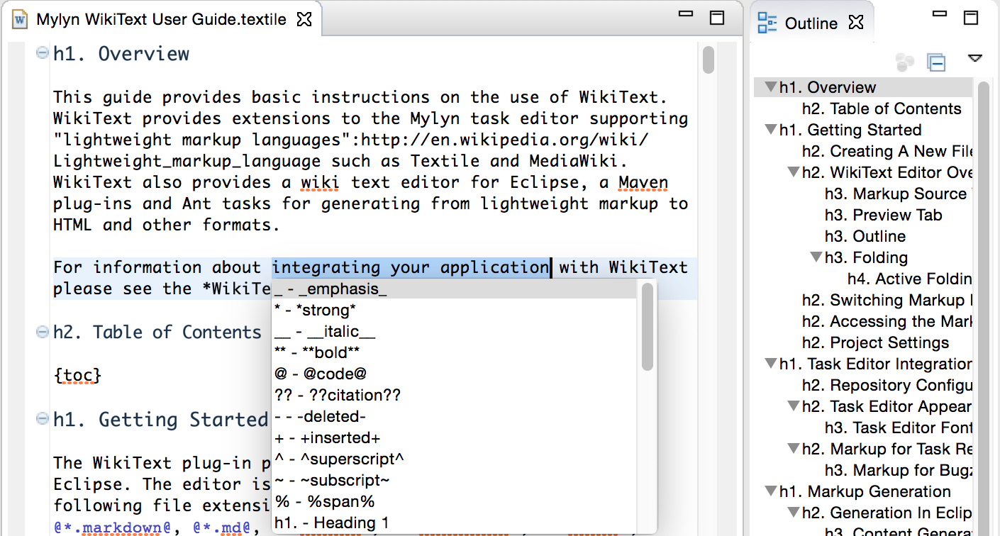

Welcome to Green's Opinion, a site by [David Green](about).  Here are some of my projects:

  

    

      

        <h3><a href="https://github.com/greensopinion/greenbeans">Green Beans</a></h3>
        
A personal finance app, designed for simplicity and security.

      

      
      

        <ul>
          <li>Strong encryption and local data only - no need to <a href="http://www.informationisbeautiful.net/visualizations/worlds-biggest-data-breaches-hacks/">trust the cloud</a> with your information.</li>
          <li>Open source, so that you can see how it works.</li>
          <li>For Mac and Windows.</li>
        </ul>
        

        See <a href="https://github.com/greensopinion/greenbeans">GreenBeans on GitHub</a>
        

      

    

  

  

    

      

        <h3><a href="https://wiki.eclipse.org/Mylyn/WikiText">WikiText</a></h3>
        
A software library and tools for rich text.

      

      
      

        

        Mylyn WikiText is for rendering, transforming and manipulating Markdown, CommonMark, Asciidoc, Textile, HTML, Docbook, Dita, and may other forms of rich text.
        

        

        Mylyn WikiText integrates with Eclipse, Maven and Ant.  WikiText also provides APIs for integrating rich text into your application.
        

        

        See <a href="https://wiki.eclipse.org/Mylyn/WikiText">Mylyn WikiText</a> at eclipse.org
        

      

    

  

  

    

      

        <h3><a href="https://github.com/dgreen99/swagger-jaxrs-maven">Swagger Generator</a></h3>
        
Provides a Maven plug-in that can generate <a href="http://swagger.io">Swagger</a> documentation for JAX-RS web services.

        
See <a href="https://github.com/dgreen99/swagger-jaxrs-maven">swagger-jaxrs-maven on GitHub</a>

      

    

  

